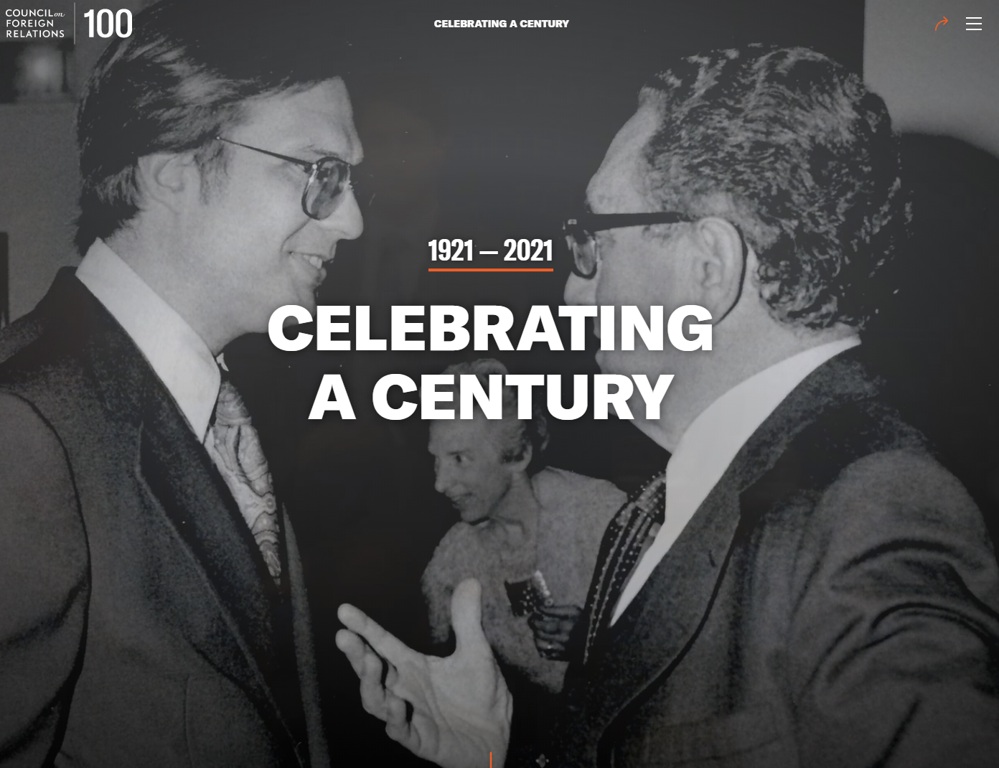
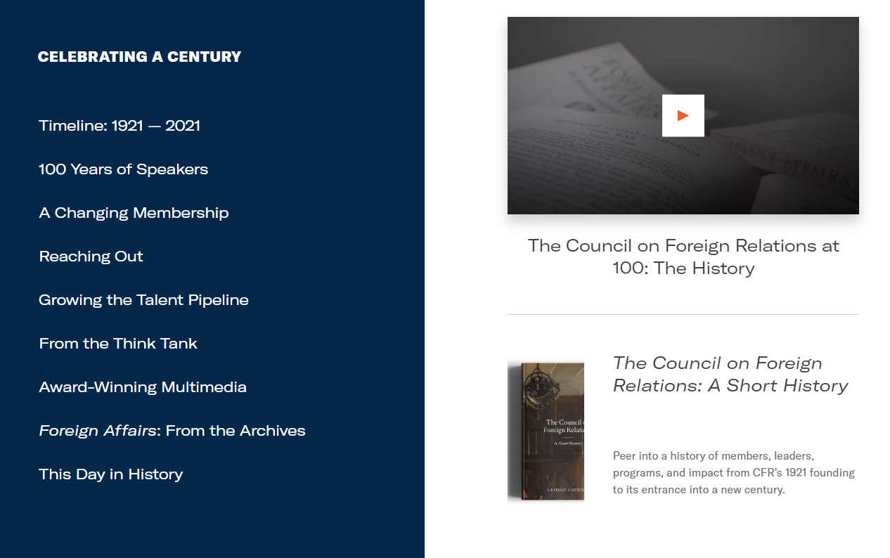
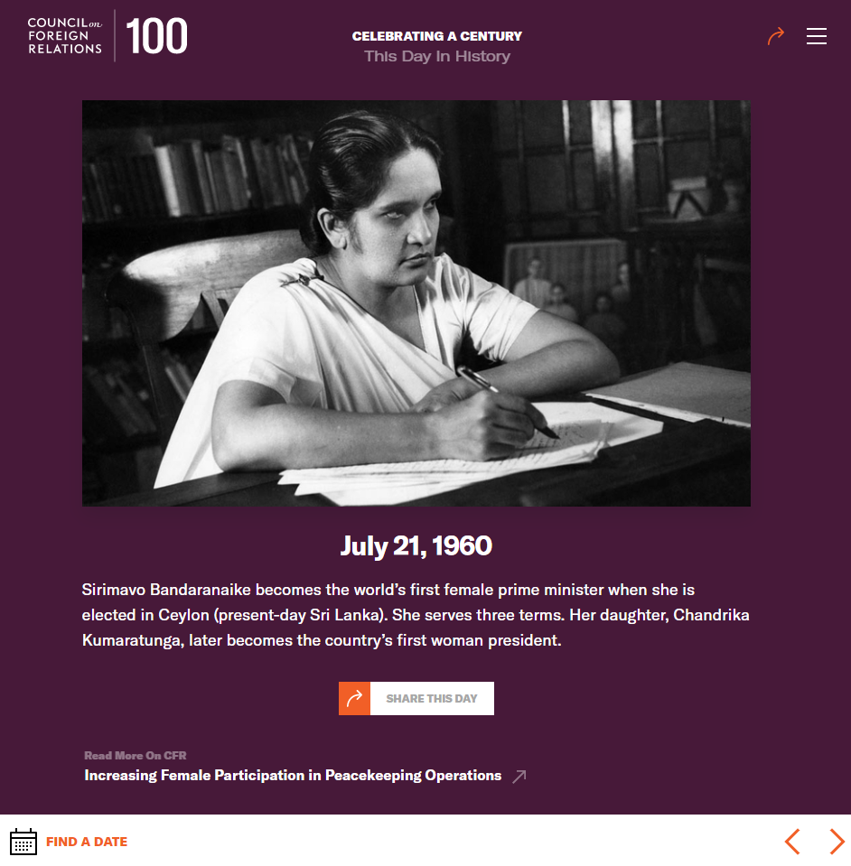
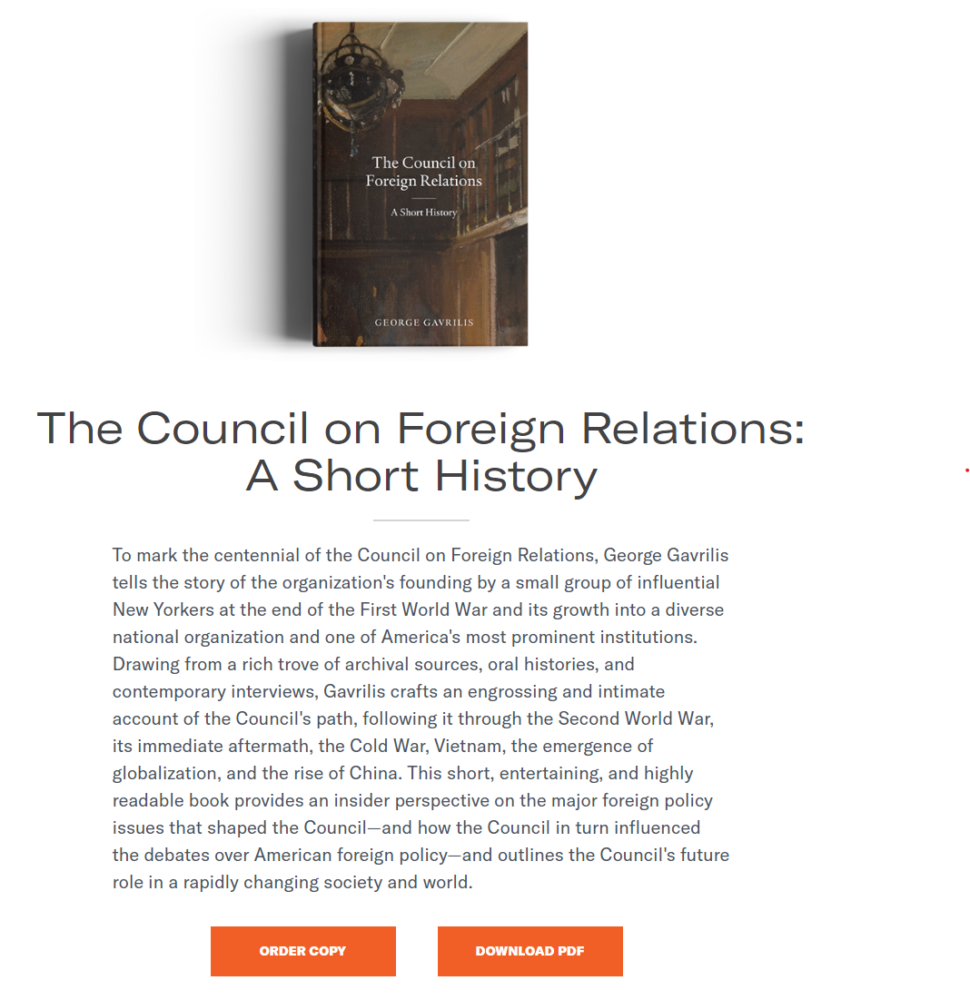

The Council on Foreign Relations celebrated its 100th birthday in 2021, and to commemorate the event, CFR developed a Gatsby-powered site that explores the organization's history throughout the years.

I onboarded just before it entered user acceptance testing, so I was directly involved with fixing bugs arising from the React components and GraphQL queries, particularly for pages which derived their content from JSON data files like the "This Day in History" module. I also created new pages or components when required, like this [book page](https://cfr.org/celebrating-a-century/book).

---

