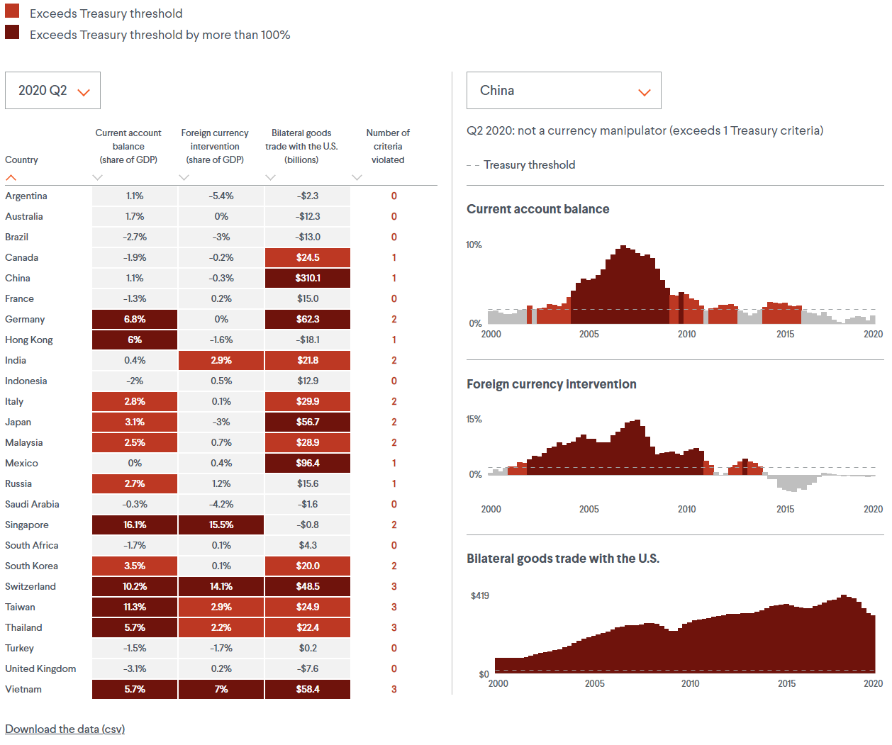

For this project, I used my graphics generation platform, <Link to={`/vallenato`}>Vallenato</Link>, to compile and visualize data. Vallenato leverages billboard.js, a re-usable charting interface for D3.js.

The tracker highlights indicator values in red when they exceed the U.S. Treasury threshold for currency manipulation. Select a fiscal quarter, going back to 2000, to compare twenty-five economies across three indicators. Scroll down to select an economy to view its historical data. Scroll further down to read about the data and view additional resources.

---

