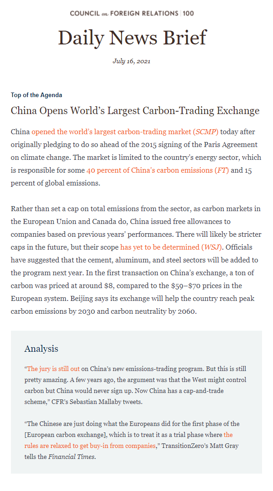

Leveraging [MJML.io](https://github.com/mjmlio/mjml), a framework for developing re-usable components for responsive emails, I was able to modernize the Council on Foreign Relations' *Daily News Brief* newsletter by making it responsive across multiple devices, browsers, and email clients. Developing responsive emails is tricky and there were many lessons learned, particularly when it came to making emails compatible for multiple versions of Outlook which can run on wildly different device configurations. Litmus was invaluable in helping me check the quality of my work across those conditions. 

By using MJML and developing re-usable components for the newly designed templates, I allowed newsletter editors to enjoy a quicker and more efficient campaign authoring experience. Previously, newsletter editors were required to use a legacy CFR system which had an outdated style, lacked responsiveness, and was difficult to use.

Many of the techniques used to redesign the *Daily News Brief* were reused for other CFR newsletter products, such as *The World This Week*. As CFR switched email service providers to Sailthru, I was instrumental in ensuring the style standardization of several components that are now used in more than 70 custom newsletter templates.

The link above will take you to a recent *Daily News Brief* campaign.

---

