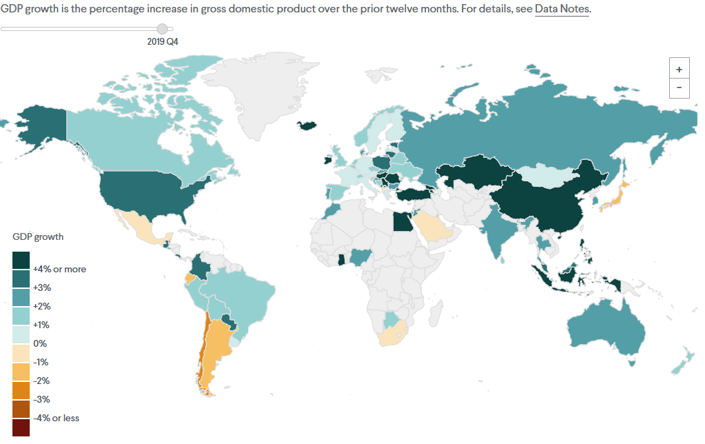
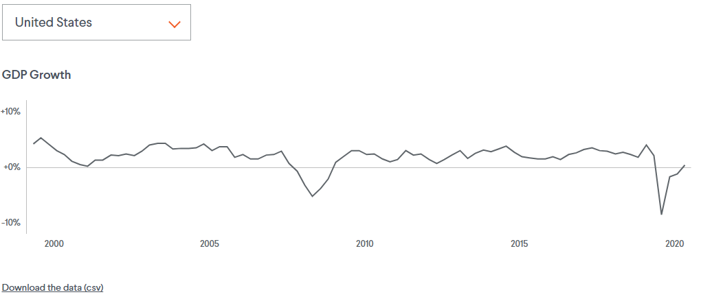

For this project, I leveraged <Link to={`/vallenato`}>Vallenato</Link>, an interactive graphics generator I built for CFR, in order to maintain consistent styles and a platform for the custom data tables, charts, and map. Dragging the slider changes time, and hovering over a country or point in the chart shows specific information.

This tracker charts the economic growth performance through time of ninety-one countries around the globe. The map compiles data on economic growth in ninety-one countries around the world, mainly those that report quarterly data to the International Monetary Fund (IMF). Growth is defined as the rate of change, over the prior twelve months, in each country’s gross domestic product (GDP), which is the total value of goods and services produced there.

---

