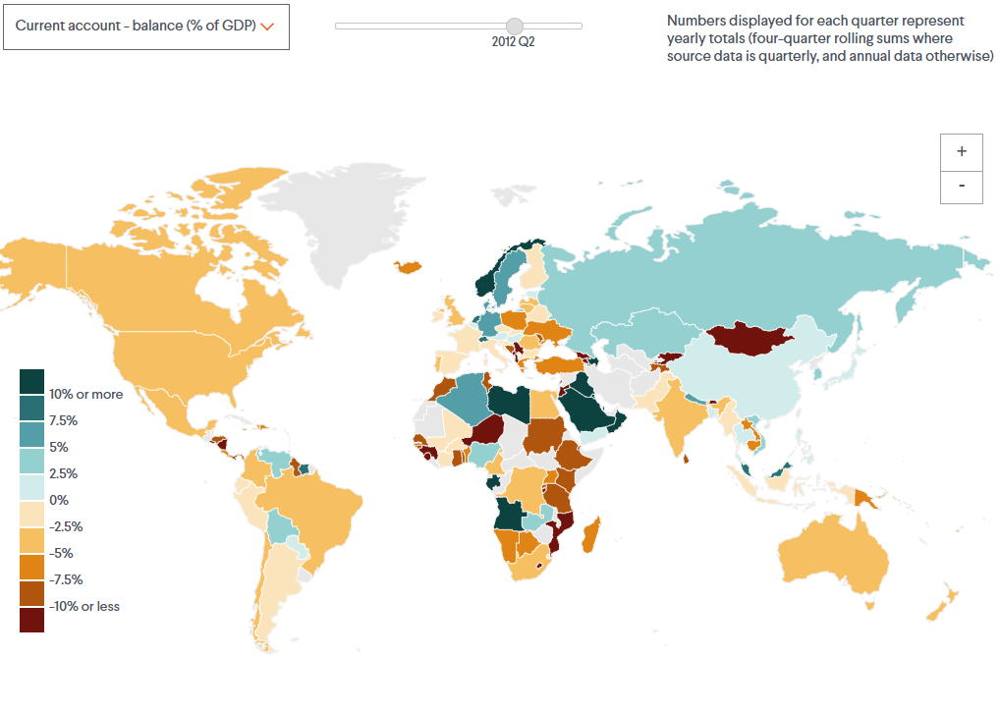
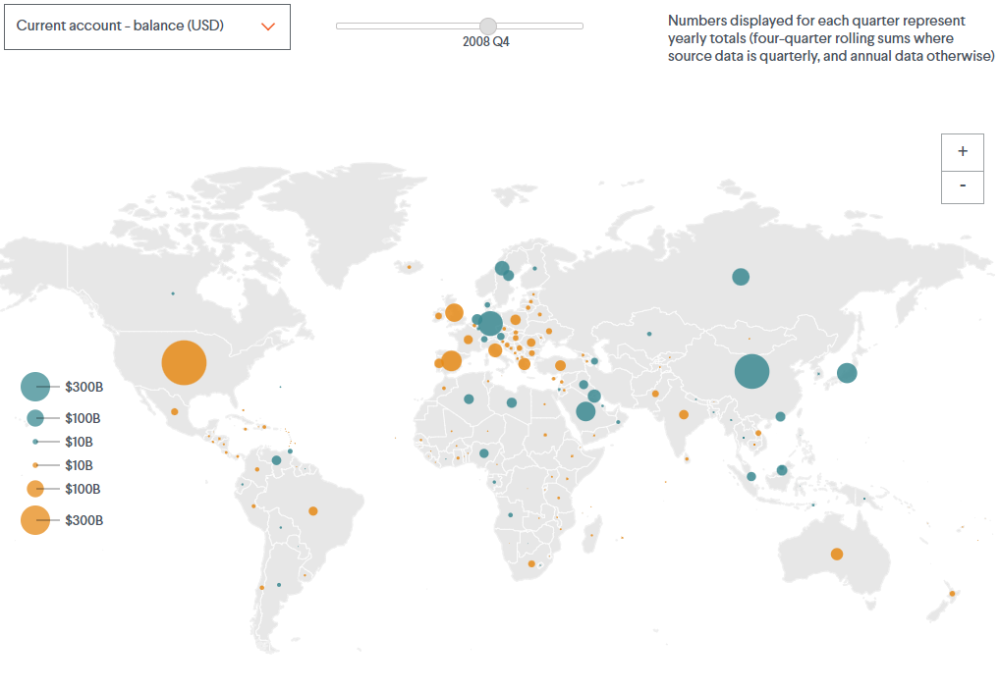
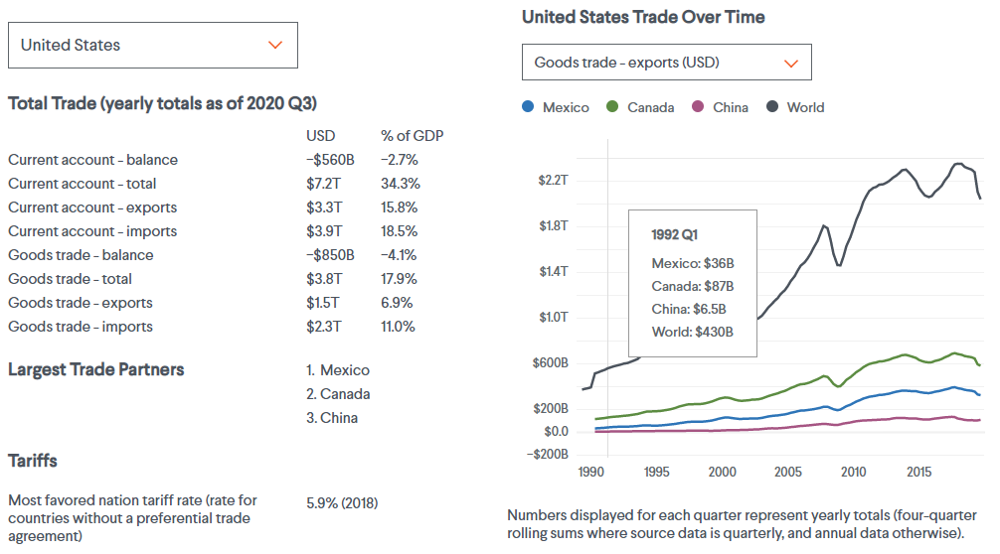

For this project, I leveraged <Link to={`/vallenato`}>Vallenato</Link>, an interactive graphics generator I built for CFR, in order to maintain consistent styles and a platform for the custom data tables, charts, and map. Dragging the slider changes time, and hovering over a country or point in the chart shows specific information.

The map section compiles trade data from 178 countries that report them to the International Monetary Fund (IMF). It displays values for each country’s trade in tangible goods and, for countries reporting the necessary data to the IMF, it also shows them on their current accounts (that is, adding in services trade, payments to investors abroad, and other foreign funds transfers.) You can break down the data further to view countries' exports, imports, total trade volume, or balance of trade, and in terms of U.S. dollars or as a share of countries' gross domestic product (GDP).

For 60 large national economies, you can also view historical trade data on the chart section. Select a country with the left-hand drop-down menu, and which data to display with the right-hand one. For goods trade, the chart also shows each country’s relations with its three largest trading partners. To the left of the chart, you can see the selected country’s most recent trade figures, its largest trading partners, and its average tariff rates.

---

