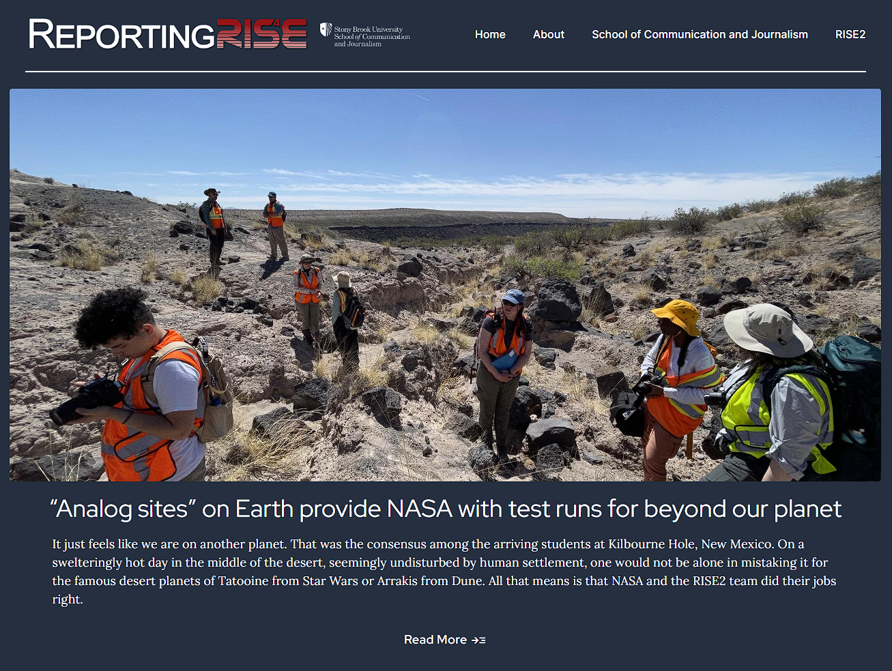

In 2015, 2017, and 2022, I had the privilege of joining Stony Brook University journalism students as they shadowed a team of scientists representing NASA and several universities around the world. Along with another professor on the trips, my role was to help teach multimedia journalism to the students as they reported, in the field, on NASA's renewed focus on lunar and space exploration. They learned photo and video skills and how to use their field equipment. 

Following each trip, I would design a website showcasing their reporting, which was then shared throughout Stony Brook and NASA networks. For the latest site, I used a Gatsby-powered website, hosting on Netlify and utilizing Netlify CMS to input content. The user interface was developed using React.js. [View the repo here.](https://github.com/kevinlizarazo/reportingris4e2022)

---
