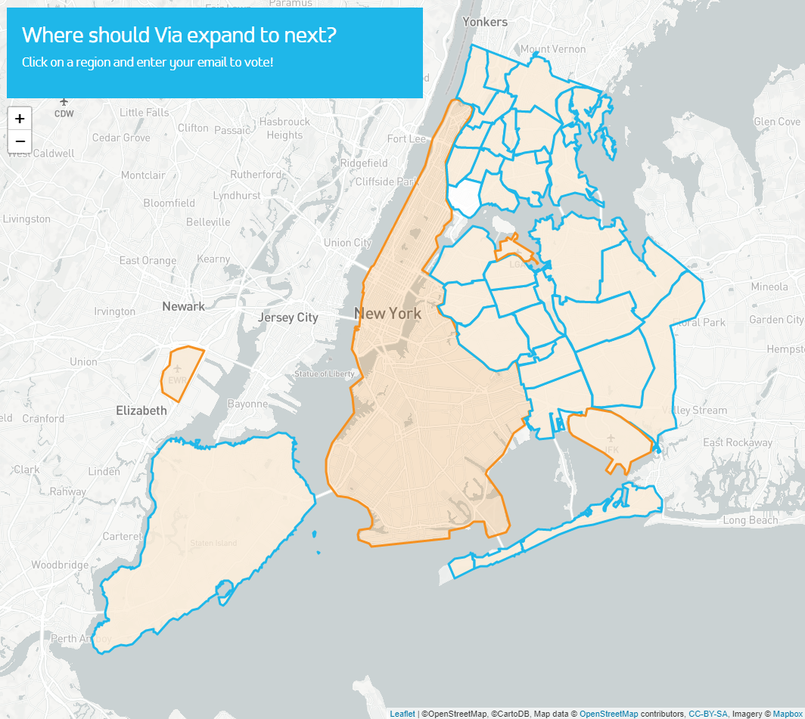

Early on in my career, in 2017, I was asked to help [Via](https://ridewithvia.com) create a simple form by which people in New York City could vote for the next region Via should expand into. I used Leaflet and Mapbox to generate a map of NYC. GeoJSON files provided the borders for drawing out the expansion zones, and the form hooked into a Google Sheet that provided my client with the requested voting data. The *New York Times* [wrote a little thing](https://www.nytimes.com/2017/11/05/nyregion/via-carpool-neighborhood-voting.html) about the event, which was pretty cool. I would later go on to create similar web pages for Via's efforts in [Washington D.C.](https://viapolling-lizarazo.netlify.app/dc/) and [Chicago](https://viapolling-lizarazo.netlify.app/chicago/) (demo sites for all links).

---

