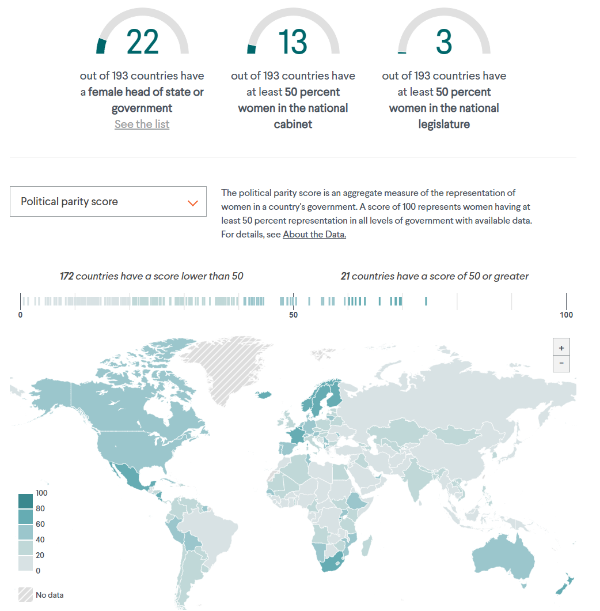

Initially, the Product & Design team at the Council on Foreign Relations did not have a cohesive system for producing interactive and static graphics. Data visualizations commonly lacked shared or re-usable CSS rules. It also did not have a way to consistently publish them on cfr.org or its various microsites. I created Vallenato to solve this problem. Vallenato allows the designers and developers within CFR Digital's various teams to quickly generate graphics for the web, and lets them focus more on creating great experiences while letting the system handle CFR's styleguide enforcement across all projects.

By running a command-line script and entering project-specific information, any user can locally initialize and render basic line charts, area charts, bar graphs, and more, complete with placeholder data, in their browser, in no time. I leverage [billboard.js](https://github.com/naver/billboard.js), a re-usable charting interface for D3.js, to accomplish this.

For the power-users on our team, Vallenato supports bespoke interactives. Users can simply select `Custom project` when running the command-line script and the system generates a project folder complete with the bare-yet-prefilled necessities: a .js entry point, an .html file to see their work locally, and a custom stylesheet for any alterations on top of the common styles that all projects pull from. From there, users can install whatever project-specific dependency they require to complete the graphic. I recently built [a tracker](https://pr-5-vallenato.pantheonsite.io/global_trade_tracker) that combines maps and charts in one project using this method.

Graphic designers can leverage a built-in `Adobe Illustrator-to-HTML` utility script to turn specially-crafted static `.ai` files into responsive SVGs for the web. This utility has been invaluable for CFR Digital's Editorial team, as they must often respond to news topics with [explanatory infographics](https://www.cfr.org/backgrounder/paris-global-climate-change-agreements).

Express.js watches and recompiles the project as it detects changes to the source files. When ready for production, pull requests made with GitHub are then captured by CircleCI, which builds out selected projects and publishes it on the web, letting my team know via Slack when builds are successful or when there are issues. Vallenato previously used Netlify, a popular hosting and serverless backend service. 

### Supported:
- Project-level dependencies
- Image and SVG inlining
- D3.js v6 by default
- ai2html
- Custom projects for interactives that require more or less than the default billboard/D3 configuration
- Tailwind
- Shared resources (CSS, JS, images, data)
- Slack integration (for communicating deployment statuses)

Below is an example of an interactive, the Women's Power Index, which was built on Vallenato by data visualization designers at CFR. Check it out [here](https://www.cfr.org/article/womens-power-index).

---

